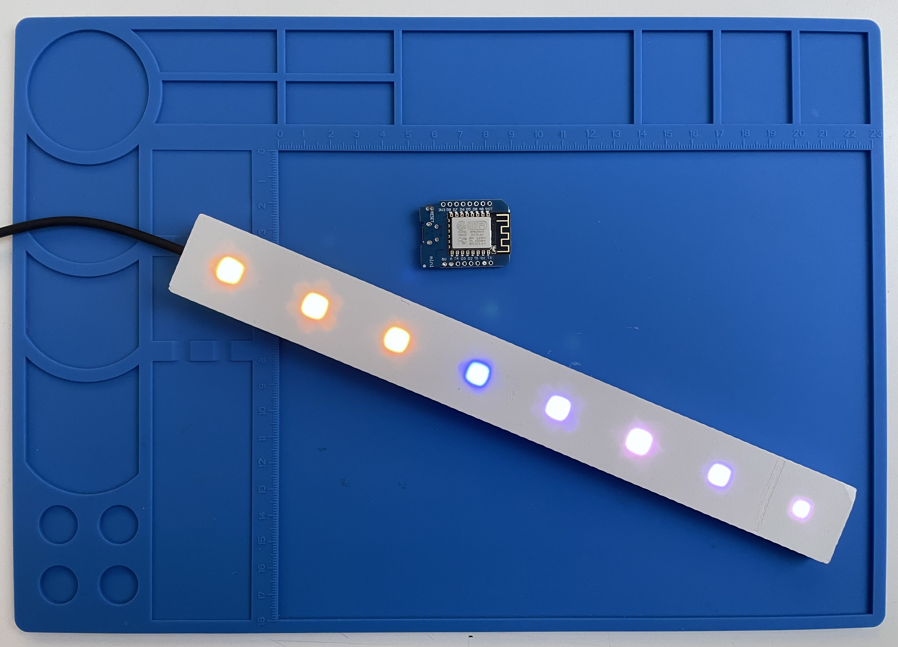

# WeatherLEDs

Shows daily weather forecasts on a RGB LED stripe connected to an ESP8266.  
The next 8 days are represented each by one animated, colored pixel.  
Uses local weather forecast data from [OpenWeatherMap](https://openweathermap.org) (formerly used DarkSky API).

## Colors

- Yellow: sunny.
- Fading between yellow and white: cloudy (more yellow or white depending on cloud coverage).
- A darker steady white shows fog.
- Blue: rain, the heavier, the more it flickers.

(Should be pretty self-explanatory)

## Requirements

- ESP8266 board such as NodeMCU, Adafruit Huzzah Feather or WeMos D1 mini.
- A [NeoPixel](https://learn.adafruit.com/adafruit-neopixel-uberguide/neopixel-strips) compatible LED stripe with exactly 8 LEDs.
- [PlatformIO](https://platformio.org) (or the Arduino IDE).
- [OpenWeatherMap API account](https://openweathermap.org/api) (you only need the free account tier)

When using the Arduino IDE, install these:
- [ESP8266 core for Arduino](https://github.com/esp8266/Arduino) (via built-in board manager)
- Libraries (via built-in library manager):
  - [ArduinoJson](https://github.com/bblanchon/ArduinoJson) 6.x +
  - [NeoPixelBus by Makuna](https://github.com/makuna/NeoPixelBus) 2.x +

## How to use

1. Connect the LEDs to +5V (red) and ground (black), the third data line goes to `GPIO3` (`RX` on WeMos D1 mini).
   - Note: on ESP8266, only `GPIO3` will work.
2. Enter your WiFi credentials, location and the OpenWeatherMap API key into the code (definitions at the top).
3. Connect the ESP8266 and program it:   
   - with PlatformIO: `platformio run -t upload` (or the run/upload button in VSCode).
   - or with Arduino IDE: open `WeatherLEDs/WeatherLEDs.ino` and click the run/upload button.

## Enclosure

A not-so-perfect 3D printable enclosure (pictured above) is included (`3D print parts/WeatherLEDs_V8.stl`), 
suitable for a stripe with 8 30mm spaced, 5x5mm quadratic WS2812B RGB LEDs, and a WeMos D1 mini board.
